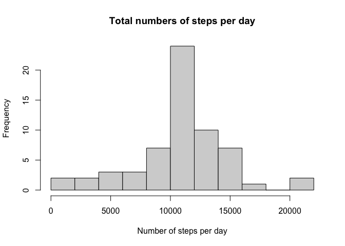

First, we load all the required packages we are going to use 


```r
library(dplyr)
```

```
## 
## Attaching package: 'dplyr'
```

```
## The following objects are masked from 'package:stats':
## 
##     filter, lag
```

```
## The following objects are masked from 'package:base':
## 
##     intersect, setdiff, setequal, union
```

```r
library(ggplot2)
```

## Loading and preprocessing the data

Then,  we read the activity data by using `read.csv`


```r
data <- read.csv(unz("activity.zip","activity.csv"))
```

We inspect the data checking the first rows


```r
head(data)
```

```
##   steps       date interval
## 1    NA 2012-10-01        0
## 2    NA 2012-10-01        5
## 3    NA 2012-10-01       10
## 4    NA 2012-10-01       15
## 5    NA 2012-10-01       20
## 6    NA 2012-10-01       25
```

We clean the data by removing all rows where `NA` values are found


```r
clean_data <- data[complete.cases(data),]
```

## What is mean total number of steps taken per day?

Then we calculated the total number of steps per day, by grouping and summing the information in data


```r
data_per_day <- clean_data %>% group_by(date) %>%
  summarise(mean=mean(steps), sum=sum(steps))
```

We check this information by showing the histogram of the steps per day, binned in ten different ranges.

```r
hist(as.numeric(data_per_day[['sum']]), breaks = 10, main = "Total numbers of steps per day", xlab = "Number of steps per day")
```

<!-- -->

Then the mean and median total number of steps per day will be

```r
lapply(data_per_day['sum'], mean)
```

```
## $sum
## [1] 10766.19
```

```r
lapply(data_per_day['sum'], median)
```

```
## $sum
## [1] 10765
```

## What is the average daily activity pattern?

Now we check the five minute intervals of the steps taken


```r
data_per_5min <- clean_data %>% group_by(interval) %>%
  summarise(mean=mean(steps), sum=sum(steps))
```

We plot the the time series of these intervals with respect to the number of steps for all days


```r
ggplot(data = data_per_5min, aes(x = interval, y = mean))+ geom_line(color="#00AFBB", size=2) + labs(title = "Average daily pattern", x="5 minute interval", y= "Average number of steps")
```

<!-- -->

Then, we search for the interval with the higher number of steps


```r
data_per_5min$interval[which.max(data_per_5min$mean)]
```

```
## [1] 835
```

## Imputing missing values

In the original `data` we have some `NA` values, here we count those `NA` in the steps column (As this column is the only one with `NA`)


```r
sum(is.na(data))
```

```
## [1] 2304
```

There are many ways to impute these data, but the most logical is to use the integer of the 5 minute average for those intervals. We impute those values here by merging the two datasets and then replacing the `steps` values with the mean where there is a `NA`, finally we order by date


```r
merged_data <- merge(data_per_5min, data, by = c("interval"), all.y = TRUE, sort = FALSE)
merged_data$steps <- ifelse(is.na(merged_data$steps), as.integer(merged_data$mean), merged_data$steps)
merged_data$mean <- NULL
merged_data$sum <- NULL
merged_data <- merged_data[order(merged_data$date),]
head(merged_data)
```

```
##     interval steps       date
## 1          0     1 2012-10-01
## 63         5     0 2012-10-01
## 128       10     0 2012-10-01
## 205       15     0 2012-10-01
## 264       20     0 2012-10-01
## 327       25     2 2012-10-01
```

Then we create the same histogram plot and the mean and median as before to check that the trends are very similar


```r
mdata_per_day <- merged_data %>% group_by(date) %>%
  summarise(sum=sum(steps))

hist(as.numeric(mdata_per_day[['sum']]), breaks = 10, main = "Total numbers of steps per day", xlab = "Number of steps per day")
```

<!-- -->

This is pretty similar to the one show before. Now we check the mean and median


```r
lapply(mdata_per_day['sum'], mean)
```

```
## $sum
## [1] 10749.77
```

```r
lapply(mdata_per_day['sum'], median)
```

```
## $sum
## [1] 10641
```

The values change a bit due to the imputation, one of the impacts is that some days where there was no data, now are shoing as the average of the 5 minute intervals, so changing the data in some days change the median more drastically. 

## Are there differences in activity patterns between weekdays and weekends?

We create a column describing if the date is a weekday or a weekend


```r
merged_data$wk <- ifelse(weekdays(as.Date(merged_data$date))%in%c("Saturday","Sunday"),"Weekend","Weekday")
```

And now we summarize again in intervals of five minutes and plot the differences


```r
mdw_per_day <- merged_data %>% group_by(interval,wk) %>%
  summarise(mean=mean(steps), sum=sum(steps))
```

```
## `summarise()` has grouped output by 'interval'. You can override using the `.groups` argument.
```

```r
ggplot(mdw_per_day, aes(x=interval, y=mean, color=wk))+ geom_line(color="#00AFBB", size=2) + labs(title = "Average daily pattern", x="5 minute interval", y= "Average number of steps") + facet_grid(wk~.)
```

<!-- -->

That's it! 
